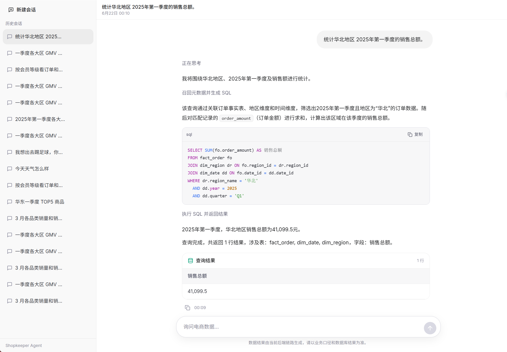
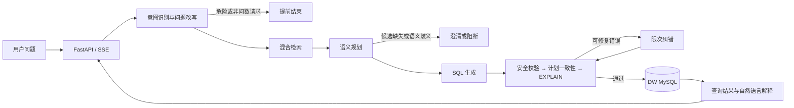

<div align="center">

# ShopInsight Agent

### 面向电商数据仓库的可信 Text-to-SQL Agent

让模型先找到业务语义、形成查询计划，再生成并执行 SQL。

[](https://www.python.org/)
[](https://fastapi.tiangolo.com/)
[](https://langchain-ai.github.io/langgraph/)
[](https://qdrant.tech/)
[](LICENSE)

[核心设计](#核心设计) · [评测结果](#评测结果) · [系统架构](#系统架构) · [快速开始](#快速开始) · [能力边界](#能力边界)

</div>

ShopInsight 将自然语言问题转换为可执行 SQL，并返回真实数据结果与自然语言解释。它不让大模型独自承担元数据理解、业务消歧和 SQL 执行，而是通过**混合检索、双层语义规划和分层校验**把一次问数拆成可追踪、可阻断、可纠错的 Agent 链路。



## 评测结果

项目使用同一套 **80 条人工电商问数评测集**验证检索与端到端效果。问题覆盖时间范围、多指标、多筛选、分组聚合、排序与 Top-N 等场景，并维护对应的标准 SQL、字段、指标和字段值标注。

| 评测目标 | 原型链路 | 当前链路 | 提升 |
| --- | ---: | ---: | ---: |
| Top-5 整体候选召回率 | 86.19% | **98.90%** | **+12.71 个百分点** |
| 端到端查询结果正确率 | 78.75% | **95.00%** | **+16.25 个百分点** |

- **候选召回率**：正确字段、指标和字段值进入各自 Top-5 候选的比例，共统计 181 个 Gold。
- **结果正确率**：系统 SQL 与标准 SQL 在同一 DW MySQL 执行，比较返回列、行集合、数值及必要顺序；只有业务结果等价才计为正确。
- 两轮评测共用 [`examples/eval_resume_80.yaml`](examples/eval_resume_80.yaml)，避免分别选择有利于单个模块的数据。

<details>
<summary>查看评测口径与复现说明</summary>

召回 A/B 保持评测集、索引、Embedding 模型和 Top-5 候选预算一致。原型链路使用完整问题与 Jieba 关键词，字段和指标由原始向量 point 直接竞争 Top-5，字段值只使用 Elasticsearch；当前链路改为领域化查询扩展、Qdrant 候选分组和 Elasticsearch + Qdrant 加权 RRF。

端到端结果受模型快照与生成随机性影响。当前 95% 由一次完整运行、确定性结果重判及修复后的针对性真实回归合并得到；如用于正式发布门禁，应冻结模型快照并执行多轮完整复测。

```bash
# 检索 A/B
uv run python -m app.scripts.run_retrieval_ab \
  --cases examples/eval_resume_80.yaml \
  --output eval/runs/retrieval-ab.json

# 当前链路端到端评测
uv run python -m app.scripts.run_eval \
  -c examples/eval_resume_80.yaml \
  --output eval/runs/current.json
```

</details>

## 为什么需要 ShopInsight

普通 Text-to-SQL 往往把数据库 Schema 和用户问题直接交给模型。它可能写出语法正确的 SQL，却仍然答错业务问题：

- “销售额”应该使用哪个指标口径？
- “华南”对应哪个字段下的哪个真实取值？
- 多张业务表应该沿哪条关系连接？
- 模型生成的 SQL 是否偏离了已经识别的查询意图？
- 语义不完整或 SQL 不安全时，系统应该修复、澄清还是阻断？

ShopInsight 的核心思路是：**检索负责发现候选，模型负责理解语义，后端负责确定性裁决，数据库负责验证与执行。**

## 系统架构



LangGraph 只展示产品级主链：

```text
意图识别 → 上下文构建 → 语义规划 → SQL 生成 → SQL 校验执行
    │                          │                    │
    └─ blocked → END           └─ blocked → END     └─ success / failed → END
```

检索扩展、候选融合、确定性解析、SQL 校验和纠错保留在对应节点内部，避免把实现细节全部暴露成图节点。

## 核心设计

### 1. 分路混合检索

字段、指标和字段值具有不同的数据结构与下游用途，因此采用独立检索链路：

- **字段与指标**：完整问题与领域化扩展词分别检索 Qdrant；查询阶段按候选 ID 分组，避免名称、别名和描述对应的多个 point 重复占用 Top-K，再通过全局 RRF 得到最终候选。
- **字段值**：Elasticsearch 负责真实取值的词面匹配，Qdrant 负责自然语言语义匹配，两路结果按稳定候选 ID 使用加权 RRF 融合。
- **权威补全**：Meta MySQL 只补齐已召回候选的字段、指标、表关系和主外键，不把全量元数据直接塞给模型。
- **成功 SQL 记忆**：按用户与元数据版本召回历史成功问题和 SQL，为后续生成提供 few-shot 参考。

### 2. 双层语义规划

检索只能证明候选与问题相关，不能证明它就是用户真正想表达的业务对象。

1. 系统将召回的字段、指标和字段值整理为带稳定 ID 的权威候选。
2. 受 Pydantic Schema 约束的 LLM 从候选中表达指标、维度、谓词、排序和 JOIN 偏好。
3. 后端校验候选存在性与归属关系，确定性解析时间条件，并根据模型选择的关联边补齐连接所有必需表的最短关系闭包。
4. 校验通过后形成结构化查询计划；候选缺失或语义歧义时，在 SQL 生成前澄清或阻断。

SQL 生成模型只消费已经确认的查询计划和必要物理元数据，不再从原始召回上下文中重新猜测业务语义。

### 3. 可信 SQL 执行

SQL 不会在生成后直接访问数仓，而是依次经过：

1. **输入与语义边界**：拦截提示词注入、危险操作、明显非问数请求和无法确定的业务语义。
2. **SQL 安全校验**：解析 SQL，限制为只读查询，并检查危险语句、敏感字段和越界访问。
3. **计划一致性校验**：比较 SQL 与结构化查询计划中的指标、维度、谓词、排序、Limit 和 JOIN 关系。
4. **真实数据库校验**：使用 DW MySQL `EXPLAIN` 验证语法、字段、表和数据库执行可行性。
5. **限次纠错**：仅将查询计划、校验差异和失败 SQL 交给修复模型；每次修复后重新执行完整校验，并检测重复 SQL 与无变化错误。
6. **受控执行**：通过全部校验后执行只读 SQL，应用超时限制，并对结果生成简短解释。

## 技术栈

| 层级 | 技术 | 职责 |
| --- | --- | --- |
| 前端 | React 19、TypeScript、Vite、Tailwind CSS | 会话界面、SQL 与表格展示、SSE 状态流 |
| API | FastAPI、Pydantic | 流式问数接口、依赖注入与生命周期管理 |
| Agent | LangGraph、LangChain | 状态编排、模型调用、语义规划与限次纠错 |
| 检索 | Qdrant、Elasticsearch | 字段、指标和字段值的向量/全文混合检索 |
| 数据 | MySQL、SQLAlchemy、asyncmy | 权威元数据、教学数仓、`EXPLAIN` 与查询执行 |
| SQL | SQLGlot | SQL 解析、安全校验与计划一致性分析 |
| 工程 | uv、pytest、Ruff、pnpm | 依赖、测试、静态检查和前端构建 |

## 快速开始

### 环境要求

- Python `>= 3.14`
- [uv](https://docs.astral.sh/uv/)
- Docker 与 Docker Compose
- Node.js `>= 20`
- pnpm `10.x`
- 兼容 OpenAI API 的对话模型与 Embedding 服务

### 1. 安装依赖

```bash
git clone https://github.com/CR-730/shopinsight-agent.git
cd shopinsight-agent

uv sync
cd frontend
pnpm install
cd ..
```

### 2. 配置模型

在项目根目录创建 `.env`：

```dotenv
LLM_PROVIDER=openai
LLM_BASE_URL=https://your-openai-compatible-endpoint/v1
LLM_API_KEY=your_api_key
LLM_MODEL=your_main_model
LLM_FAST_MODEL=your_fast_model
EMBEDDING_MODEL=your_embedding_model

LLM_TIMEOUT_SECONDS=60
LLM_STRUCTURED_ENABLE_THINKING=false
LLM_GENERATE_SQL_ENABLE_THINKING=false
LLM_CORRECT_SQL_ENABLE_THINKING=false
LLM_INPUT_PER_1M_TOKENS=0
LLM_OUTPUT_PER_1M_TOKENS=0
```

> `.env` 已被 Git 忽略，请勿提交真实 API Key。更换 Embedding 模型时，请同步修改 [`conf/app_config.yaml`](conf/app_config.yaml) 中的向量维度并重新构建元数据知识库。

### 3. 启动基础设施

```bash
docker compose -f docker/docker-compose.yaml up -d
docker compose -f docker/docker-compose.yaml ps
```

| 服务 | 默认地址 |
| --- | --- |
| MySQL | `localhost:3307` |
| Elasticsearch | `http://localhost:9200` |
| Kibana | `http://localhost:5601` |
| Qdrant | `http://localhost:6333` |

MySQL 首次启动时会执行 [`docker/mysql/meta.sql`](docker/mysql/meta.sql) 和 [`docker/mysql/dw.sql`](docker/mysql/dw.sql)，初始化元数据库与教学数仓。

### 4. 构建元数据知识库

```bash
uv run python -m app.scripts.build_meta_knowledge -c conf/meta_config.yaml
```

该命令会同步表、字段、指标与别名，并重建 Qdrant 和 Elasticsearch 检索数据。修改数仓结构、元数据配置或 Embedding 模型后需要重新执行。

### 5. 启动服务

```bash
# 终端 1：FastAPI
uv run fastapi dev main.py

# 终端 2：React
cd frontend
pnpm dev
```

- 前端：`http://127.0.0.1:5173`
- API 文档：`http://127.0.0.1:8000/docs`

## API

```http
POST /api/query
Content-Type: application/json
```

```json
{
  "query": "统计 2025 年第一季度华北和华南各商品品类的销售额和订单量",
  "conversation_id": null,
  "user_id": "anonymous"
}
```

接口返回 `text/event-stream`，事件包含执行进度、生成 SQL、查询结果、自然语言解释或失败信息。

| 方法 | 路径 | 说明 |
| --- | --- | --- |
| `GET` | `/api/conversations?user_id=anonymous` | 获取会话列表 |
| `GET` | `/api/conversations/{conversation_id}?user_id=anonymous` | 获取会话详情 |
| `DELETE` | `/api/conversations/{conversation_id}?user_id=anonymous` | 删除会话 |

## 项目结构

```text
.
├── app/
│   ├── agent/
│   │   ├── nodes/             # LangGraph 产品级节点
│   │   ├── semantic_planning/ # 查询草案、候选解析与结构化计划
│   │   └── sql/               # SQL 安全、计划一致性、纠错与执行
│   ├── api/                   # FastAPI 路由、Schema 与依赖
│   ├── evaluation/            # 评测加载、召回与结果判定
│   ├── repositories/          # MySQL、Qdrant、Elasticsearch 访问
│   ├── scripts/               # 元数据构建、评测和冒烟脚本
│   └── services/              # 查询服务与元数据服务
├── conf/                      # 应用、元数据与安全策略配置
├── docker/                    # 本地基础设施
├── examples/                  # 评测集与示例
├── frontend/                  # React 问数前端
├── prompts/                   # 各阶段 Prompt
├── tests/                     # 单元、回归与集成测试
└── main.py                    # FastAPI 入口
```

## 测试

```bash
# 后端
uv run pytest
uv run ruff check .

# 前端
cd frontend
pnpm build
```

## 配置入口

| 文件 | 用途 |
| --- | --- |
| [`conf/app_config.yaml`](conf/app_config.yaml) | 数据库、检索预算、RRF 权重、超时与后台构建 |
| [`conf/meta_config.yaml`](conf/meta_config.yaml) | 表、字段、指标、别名及表关系 |
| [`conf/policy_config.yaml`](conf/policy_config.yaml) | Prompt 注入、危险 SQL、敏感字段与访问规则 |
| [`prompts/`](prompts/) | 意图识别、检索扩展、语义规划、SQL 生成和纠错 Prompt |

## 能力边界

当前仓库用于本地开发、项目学习和电商问数链路验证，不应直接视为企业生产系统。面向生产环境仍需补充：

- 身份认证、角色权限、行列级权限与多租户隔离；
- 凭据托管、网络隔离、审计日志与敏感数据脱敏；
- 查询资源配额、缓存、限流、监控告警与高可用部署；
- 企业指标平台、数据目录和数据血缘的持续同步；
- 冻结模型快照、多轮完整复测及正式发布门禁。

## License

本项目基于 [MIT License](LICENSE) 开源。
